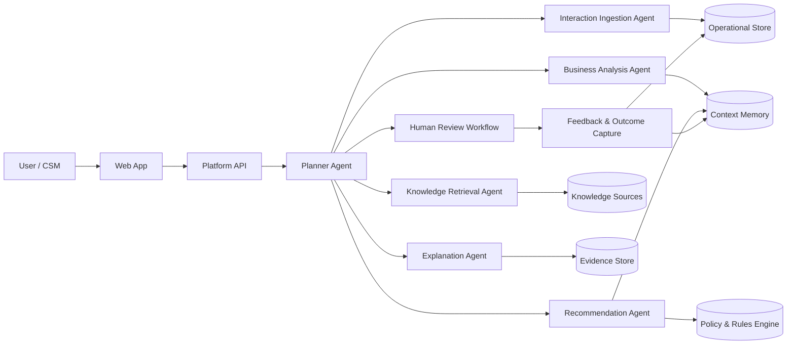
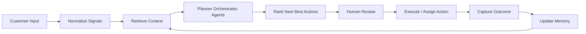

# Intelligent Next Best Action Platform Architecture

## 1. Purpose

This document describes a reusable Agentic Decision Intelligence Platform for a B2B use case. The reference implementation in this architecture is for **Customer Success in a SaaS company**, but the platform is intentionally designed so the same core engine can be reused for other business domains such as sales, staffing, or account management.

The platform’s job is to turn unstructured and structured customer signals into **actionable, explainable next best actions** with human review and continuous learning.

## 2. Business Use Case

### 2.1 Domain

B2B SaaS Customer Success, focused on renewals, adoption, expansion, and churn prevention.

### 2.2 Business Process

The platform supports a customer success manager during the account lifecycle:

1. Ingest interaction signals from calls, emails, support notes, CRM updates, and product usage.
2. Build a real-time account context.
3. Detect risks, opportunities, and missing information.
4. Recommend the next best action.
5. Explain the reasoning with evidence and confidence.
6. Send the recommendation to a human for approval.
7. Learn from the outcome and improve future recommendations.

### 2.3 Customer Journey

The target journey is:

1. Onboarding
2. Early adoption
3. Healthy usage
4. Renewal risk detection
5. Expansion identification
6. Renewal negotiation
7. Post-renewal optimization

### 2.4 Decision Points

Typical decision points include:

1. Should the CSM schedule an executive check-in?
2. Should a support escalation be opened?
3. Should the customer receive a tailored adoption plan?
4. Should the account be flagged for churn risk?
5. Should the account be routed to sales for expansion?
6. Should the renewal strategy change based on product usage or sentiment?

### 2.5 Success Metrics

Key metrics for the use case:

1. Renewal rate
2. Expansion rate
3. Churn reduction
4. Adoption improvement
5. Time to recommended action
6. Human approval rate of recommendations
7. Recommendation precision and usefulness

## 3. Platform Principles

The architecture is built around six principles:

1. **Reusable**: one core decision platform, many business domains.
2. **Explainable**: every recommendation must show why it was made.
3. **Human-guided**: recommendations are reviewed before action.
4. **Memory-aware**: the platform remembers prior interactions and outcomes.
5. **Tool-driven**: agents use tools instead of embedding all logic in one model prompt.
6. **Configurable**: business rules, workflows, and knowledge sources can be swapped without rebuilding the platform.

## 4. High-Level Design (HLD)



### 4.1 Layer Summary

1. **Experience Layer**: web UI for case review, recommendation review, and approval.
2. **API Layer**: auth, routing, session management, and audit logging.
3. **Orchestration Layer**: planner agent decides which specialist agents to invoke.
4. **Intelligence Layer**: analysis, retrieval, reasoning, recommendation, and explanation.
5. **Knowledge Layer**: documents, CRM, product telemetry, support history, memory, and rules.
6. **Governance Layer**: approvals, confidence thresholds, audit trail, and outcome tracking.

## 5. Core Components

### 5.1 Web Application

The UI should provide:

1. Account timeline with recent interactions.
2. Consolidated account context.
3. Recommended next best actions.
4. Evidence panel for each recommendation.
5. Confidence score and rationale.
6. Human approval, edit, or reject controls.
7. Feedback capture after execution.

### 5.2 Platform API

The API handles:

1. Authentication and authorization.
2. Session and tenant management.
3. Request validation.
4. Orchestration requests to the planner agent.
5. Retrieval of results, evidence, and history.
6. Audit logging.

### 5.3 Planner Agent

The planner is the control plane of the platform. It does not try to solve everything itself. Instead, it:

1. Interprets the user goal.
2. Determines which agents are needed.
3. Sequences the work.
4. Calls tools and specialist agents.
5. Aggregates outputs into a decision package.

Example planner responsibilities:

1. Detect whether the request is about risk, opportunity, or both.
2. Decide whether product usage analysis is needed.
3. Decide whether CRM history or playbooks are relevant.
4. Decide whether the recommendation requires policy checks.
5. Decide whether confidence is high enough to present or needs more evidence.

### 5.4 Specialist Agents

Recommended agent set:

1. **Interaction Ingestion Agent**: parses emails, meeting notes, transcripts, and CRM updates into structured events.
2. **Knowledge Retrieval Agent**: queries playbooks, product docs, policies, and historical cases.
3. **Business Analysis Agent**: identifies risks, opportunities, gaps, sentiment, urgency, and account health.
4. **Recommendation Agent**: proposes next best actions and prioritizes them.
5. **Explanation Agent**: produces a concise explanation with evidence and confidence.
6. **Policy Agent**: checks recommendations against business rules, compliance, and escalation policy.
7. **Memory Agent**: stores and recalls prior decisions, approvals, and outcomes.

## 6. Data Architecture

### 6.1 Input Sources

The platform should support these input types:

1. Meeting transcripts.
2. Customer emails.
3. CRM activity and notes.
4. Support tickets.
5. Product usage telemetry.
6. Knowledge articles and playbooks.
7. Renewal history and contract data.

### 6.2 Storage Model

Use a mixed storage strategy:

1. **Relational store** for tenants, accounts, users, workflows, approvals, and outcomes.
2. **Document store** for raw interactions and unstructured content.
3. **Vector store** for semantic retrieval over knowledge and historical cases.
4. **Event store** for audit logs and state changes.
5. **Memory store** for durable account context and learning signals.

### 6.3 Suggested Data Entities

1. Tenant
2. User
3. Account
4. Interaction
5. CustomerSignal
6. KnowledgeDocument
7. Recommendation
8. EvidenceItem
9. ReviewDecision
10. Outcome
11. MemoryEntry

## 7. End-to-End Workflow

### 7.1 Ingestion

1. New interaction arrives.
2. The ingestion agent extracts entities, sentiment, intent, objections, commitments, deadlines, and risk indicators.
3. The event is normalized into structured metadata.
4. The event is written to the operational store and memory store.

### 7.2 Context Assembly

1. Planner identifies the account and business objective.
2. Retrieval agent gathers relevant knowledge and account history.
3. Analysis agent merges interaction signals with operational context.
4. The platform builds a contextual decision snapshot.

### 7.3 Reasoning and Recommendation

1. Business analysis agent identifies what matters most.
2. Policy agent filters out disallowed or low-quality actions.
3. Recommendation agent ranks actions by expected business value.
4. Explanation agent attaches evidence, confidence, and assumptions.

### 7.4 Human Review

1. User sees recommendations in the UI.
2. User can approve, edit, defer, or reject.
3. User feedback is captured as training and evaluation signal.

### 7.5 Learning Loop

1. Approved recommendations and outcomes are stored.
2. Rejected recommendations are analyzed for failure patterns.
3. Memory is updated with new account facts, preferences, and policy refinements.
4. Future recommendations use the improved memory and history.

### 7.6 Project Workflow Summary

The project runs in this order:

1. **Collect input**: ingest emails, meeting notes, CRM updates, transcripts, and support tickets.
2. **Normalize data**: extract entities, intent, sentiment, risks, commitments, and deadlines.
3. **Build context**: retrieve account history, playbooks, policies, and relevant knowledge.
4. **Orchestrate agents**: planner routes the request to ingestion, retrieval, analysis, recommendation, and explanation agents.
5. **Generate actions**: rank the best next actions based on evidence, rules, and confidence.
6. **Review with humans**: show the recommendations in the UI for approval, edit, or rejection.
7. **Execute and record**: approved actions are executed or assigned, and the decision is logged.
8. **Learn continuously**: feedback and outcomes update memory so the next recommendation improves.



## 8. Memory Design

The platform should use multiple memory types.

### 8.1 Short-Term Memory

Used within a single workflow execution.

Contains:

1. Current request.
2. Retrieved evidence.
3. Working assumptions.
4. Intermediate agent outputs.

### 8.2 Long-Term Account Memory

Stores durable customer context such as:

1. Customer goals.
2. Stakeholder map.
3. Past objections.
4. Preferred communication style.
5. Risk history.
6. Prior approved actions.

### 8.3 Organizational Memory

Stores reusable knowledge such as:

1. Playbooks.
2. Best practices.
3. Win/loss patterns.
4. Escalation policies.
5. Proven workflows.

### 8.4 Learning Memory

Stores feedback signals such as:

1. Recommendation accepted or rejected.
2. Business outcome after action.
3. User edits to recommended actions.
4. Confidence calibration history.

## 9. Retrieval and Reasoning Strategy

The platform should not depend on a single retrieval method.

### 9.1 Retrieval Approach

Use hybrid retrieval:

1. Keyword retrieval for exact product names, contract terms, or policy phrases.
2. Vector retrieval for semantic similarity.
3. Metadata filters for tenant, account, segment, product line, and date.
4. Graph-style lookup for stakeholder relationships and dependency chains.

### 9.2 Reasoning Approach

The reasoning pipeline should combine:

1. Structured business rules.
2. LLM-based synthesis.
3. Evidence ranking.
4. Risk scoring.
5. Confidence estimation.

The important design choice is that recommendations should be generated from **evidence plus policy**, not from model intuition alone.

## 10. Decision Engine

The decision engine should score candidate actions using a weighted model.

### 10.1 Example Action Types

1. Schedule executive review.
2. Create support escalation.
3. Send adoption guidance.
4. Trigger renewal outreach.
5. Route to expansion specialist.
6. Request missing data.

### 10.2 Scoring Factors

1. Urgency
2. Expected business impact
3. Confidence
4. Policy compatibility
5. Effort required
6. Customer stage relevance
7. Historical success of similar actions

### 10.3 Recommendation Output

Each recommendation should include:

1. Action title.
2. Priority.
3. Rationale.
4. Supporting evidence.
5. Confidence score.
6. Risk if ignored.
7. Suggested owner.
8. Suggested deadline.

## 11. Explainability Model

Explainability is a first-class feature.

For every recommendation, show:

1. What triggered it.
2. Which documents or signals were used.
3. Which rule or policy influenced it.
4. Why it is ranked above alternatives.
5. What information is missing.
6. How confident the system is.

Good explanations should be short enough for business users and detailed enough for audit review.

## 12. Human-in-the-Loop Design

The platform should never blindly execute high-impact actions.

### 12.1 Review Modes

1. **Auto-suggest**: show recommendations only.
2. **Approval required**: user must confirm before execution.
3. **Escalation required**: high-risk actions need manager approval.
4. **Policy blocked**: unsafe or non-compliant actions are rejected.

### 12.2 Review Controls

The UI should allow the user to:

1. Approve.
2. Reject.
3. Edit.
4. Add comments.
5. Mark as done.
6. Request more evidence.

### 12.3 Feedback Capture

Capture:

1. User choice.
2. Reason for rejection.
3. Edits made.
4. Downstream outcome.

## 13. Extensibility Model

The platform should support multiple domains with minimal change.

### 13.1 What Changes Per Domain

1. Business rules.
2. Knowledge sources.
3. Action catalog.
4. Scoring weights.
5. UI labels.
6. Domain-specific agents.

### 13.2 What Stays the Same

1. Planner agent.
2. Human review flow.
3. Memory model.
4. Evidence and explanation layer.
5. Audit and feedback loop.

### 13.3 Example Reuse

The same engine can support:

1. SaaS customer success.
2. Sales deal coaching.
3. Staffing candidate prioritization.
4. Energy account risk management.
5. Support escalation triage.

## 14. Security, Governance, and Compliance

### 14.1 Security

1. Tenant isolation.
2. Role-based access control.
3. Encryption at rest and in transit.
4. Secret management.
5. Audit logging.

### 14.2 Governance

1. Version every workflow and policy.
2. Store every recommendation and approval event.
3. Keep evidence for auditability.
4. Support rollback of rules and prompts.

### 14.3 Compliance

1. Block sensitive actions when policy requires it.
2. Redact sensitive fields in logs and prompts.
3. Maintain traceability from recommendation to source evidence.

## 15. Observability and Evaluation

### 15.1 Technical Metrics

1. Latency per request.
2. Retrieval hit rate.
3. Tool success rate.
4. Planner routing accuracy.
5. Cost per recommendation.

### 15.2 Business Metrics

1. Approval rate.
2. Recommendation usefulness rating.
3. Renewal uplift.
4. Churn reduction.
5. Expansion conversion.

### 15.3 Model Quality Metrics

1. Precision of recommended actions.
2. Evidence coverage.
3. Confidence calibration.
4. Hallucination rate.
5. Policy violation rate.

## 16. Suggested Technology Stack

The challenge allows flexibility, so a practical stack is:

1. **Frontend**: React or Next.js.
2. **Backend**: Node.js or Python API.
3. **Orchestration**: planner-based agent framework.
4. **Database**: PostgreSQL for structured data.
5. **Vector Search**: pgvector, Pinecone, Weaviate, or similar.
6. **Queue / Events**: Redis, Kafka, or managed queue.
7. **Object Storage**: for transcripts, attachments, and raw docs.

The exact stack is less important than the separation of concerns.

## 17. API Surface

Suggested APIs:

1. `POST /ingest-interaction`
2. `POST /analyze-account`
3. `GET /accounts/{id}/context`
4. `POST /recommendations/generate`
5. `POST /recommendations/{id}/approve`
6. `POST /recommendations/{id}/reject`
7. `POST /feedback`
8. `GET /audit/{id}`

## 18. Example Recommendation Output

Example response shape:

```json
{
  "accountId": "acme-001",
  "recommendations": [
    {
      "action": "Schedule executive check-in within 7 days",
      "priority": "high",
      "confidence": 0.89,
      "reason": "Product usage dropped 28% over 3 weeks and the latest call transcript shows escalation concerns about workflow fit.",
      "evidence": [
        "Q2 usage report",
        "Meeting notes from June 18",
        "Open support ticket #4821"
      ],
      "policyStatus": "approved-for-review",
      "owner": "CSM",
      "deadline": "2026-06-30"
    }
  ]
}
```

## 19. Demo Storyline

For the hackathon demo, the storyline should be:

1. A customer signal arrives.
2. The planner agent routes the work to specialized agents.
3. The platform pulls context from CRM and knowledge sources.
4. The system identifies risk and opportunity.
5. The platform recommends next best actions with evidence.
6. The user reviews and approves one action.
7. The system stores feedback and updates memory.

## 20. Key Design Decisions

This design aligns with the challenge because it is:

1. **Agentic**: a planner orchestrates multiple specialized agents.
2. **Decision-focused**: output is next best action, not just retrieval.
3. **Explainable**: every recommendation includes evidence and confidence.
4. **Human-centered**: review and approval are built in.
5. **Reusable**: the same core can support multiple B2B domains.
6. **Learning-oriented**: memory improves future decisions.

## 21. Recommended Build Order

If implementing this in phases, build in this order:

1. Ingestion and context store.
2. Retrieval over documents and CRM data.
3. Planner and specialist agents.
4. Recommendation ranking.
5. Explanation and evidence panel.
6. Human approval workflow.
7. Memory and feedback loop.
8. Metrics and observability.

## 22. Final Architecture Statement

The platform should be framed as a **Decision Intelligence Operating Layer** for B2B teams. Its value is not in answering questions, but in turning fragmented business signals into trusted, auditable, and reusable next best actions.
